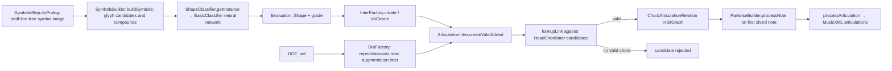

# Articulation recognition / association inspection report

Date: 2026-07-17

Scope: read-only inspection of DeepScoresV2, Audiveris, and the existing 25-omr code. No training,
dataset conversion, core OMR modification, Audiveris modification, or MusicXML implementation was
performed.

## 1. Repository and dataset state

| Item | Actual location/status |
|---|---|
| Workspace | `C:\Cheewai\OMR_work` |
| 25-omr | `C:\Cheewai\OMR_work\25-omr`, branch `main` |
| 25-omr pre-existing changes | modified `omr/inference.py`; untracked `yolo/` |
| Audiveris | `C:\Cheewai\OMR_work\audiveris`, branch `master`, clean |
| Extracted dense data | `C:\Cheewai\OMR_work\ds2_dense` |
| Expected but absent data path | `C:\Cheewai\OMR_work\datasets\deepscoresv2_dense` |
| Dense archive | `C:\Cheewai\OMR_work\ds2_dense.tar.gz` (741,814,529 bytes) |
| Complete archive | `C:\Cheewai\OMR_work\ds2_complete.tar.gz` (80,925,561,304 bytes) |
| Other large file | `尚未確認的 244827.crdownload` (80,925,561,304 bytes) |

The complete archive and `.crdownload` were not opened, moved, or deleted.

## 2. DeepScoresV2 layout and schema

```text
C:\Cheewai\OMR_work\ds2_dense\
├─ images\                 1,714 PNG
├─ instance\               1,714 indexed instance-mask PNG
├─ segmentation\           1,714 indexed semantic-mask PNG
├─ deepscores_train.json    1,362 images / 889,833 annotations
└─ deepscores_test.json       352 images / 244,335 annotations
```

`deepscores_test.json` describes itself as `Deepscores validation set in the OBB format`; therefore
the extracted dense data has train and validation, not a separately identified final test split.
There is no filename overlap between these splits.

JSON top-level fields are `info`, `annotation_sets`, `categories`, `images`, and `annotations`.

| Record | Actual fields |
|---|---|
| category | `name`, `annotation_set`, `color` |
| image | `id`, `filename`, `width`, `height`, `ann_ids` |
| annotation | `a_bbox`, `o_bbox`, `cat_id`, `area`, `img_id`, `comments` |

`a_bbox` is `[x1,y1,x2,y2]`; `o_bbox` has four `(x,y)` vertices. `cat_id` normally carries a
DeepScores category and, when available, a MUSCIMA++ compatibility category. A total of 8,717
annotations have `None` as the second taxonomy value; their DeepScores category remains present.
There are 458 non-positive integer AABBs, all in line-like categories (`stem`, `staff`,
`ledgerLine`, `ottavaBracket`, `tie`, `beam`), not in the inspected articulation classes. All 1,714
image/mask triplets are present.

## 3. DeepScoresV2 articulation classes

Counts combine train and validation. Size columns show median/mean/95th-percentile AABB size in
source pixels.

| DeepScores class | ID | Normalized prototype | Side | Instances | Images | W med/mean/p95 | H med/mean/p95 |
|---|---:|---|---|---:|---:|---|---|
| `articAccentAbove` | 71 | accent | above | 2,056 | 184 | 29/28.67/31 | 16/14.86/17 |
| `articAccentBelow` | 72 | accent | below | 1,103 | 147 | 29/28.66/31 | 16/14.88/17 |
| `articStaccatoAbove` | 73 | staccato | above | 7,601 | 294 | 6/6.41/10 | 6/6.00/8 |
| `articStaccatoBelow` | 74 | staccato | below | 2,268 | 177 | 6/6.48/10 | 6/6.01/8 |
| `articTenutoAbove` | 75 | tenuto | above | 748 | 83 | 19/19.22/24 | 2/2.90/7 |
| `articTenutoBelow` | 76 | tenuto | below | 122 | 33 | 19/19.17/24 | 2/2.76/7 |
| `articStaccatissimoAbove` | 77 | staccatissimo | above | 410 | 19 | 6/6.17/7 | 15/13.34/17 |
| `articStaccatissimoBelow` | 78 | staccatissimo | below | 263 | 11 | 6/6.26/7 | 15/14.05/17 |
| `articMarcatoAbove` | 79 | marcato | above | 256 | 49 | 15/14.82/18 | 17/17.77/26 |
| `articMarcatoBelow` | 80 | marcato | below | 267 | 31 | 15/14.97/18 | 17/18.17/26 |
| `fermataAbove` | 81 | fermata | above | 833 | 187 | 42/37.03/43 | 24/25.45/45 |
| `fermataBelow` | 82 | fermata | below | 289 | 66 | 42/36.90/43 | 24/24.62/45 |

Above/below are separate DeepScores classes. The first prototype must preserve the raw class and
side even if metrics are additionally reported after normalization to three semantic classes.
There is substantial imbalance: `articStaccatoAbove` has 62 times as many instances as
`articTenutoBelow`.

Relevant confusion categories include `repeatDot` (ID 3, 3,662 instances), `augmentationDot`
(ID 41, 24,248), accidentals (IDs 60–67), `ornamentTrill/Turn/TurnInverted/Mordent` (IDs 104–107),
staccatissimo, marcato, fermata, and `caesura` (ID 83). Staccato versus augmentation/repeat dots is
the most direct shape ambiguity; tenuto can resemble staff/ledger fragments; accent/marcato and
some wedge-like marks differ mainly by geometry and context. No DeepScores category containing
`breath` was found. The class ID distinguishes annotated instances, but detection errors remain
likely because the visual primitives are similar.

## 4. Inspection outputs

- `inspect_deepscores.py`: schema, split, integrity, class counts, image counts, and size statistics.
- `visualize_deepscores.py`: deterministic AABB+OBB overlays with class name and ID.
- `outputs/deepscores_statistics.json`: machine-readable full statistics.
- `outputs/deepscores_visualizations/`: 10 images for each of IDs 71–76 (60 total).
- `outputs/deepscores_visualizations/manifest.json`: seed, source, split, class, and output path.

Manual spot checks of accent, staccato, and tenuto overlays showed the boxes on the intended signs.

## 5. Audiveris articulation pipeline



Important source locations:

| Concern | File / class / method |
|---|---|
| Pipeline stage | `sheet/symbol/SymbolsStep.java`: `doProlog`, `doSystem` |
| Glyph construction/classification | `sheet/symbol/SymbolsBuilder.java`: `buildSymbols`, `evaluateGlyph` |
| Active classifier | `classifier/ShapeClassifier.java`: `getInstance` returns `BasicClassifier` |
| Classifier output | `classifier/Evaluation.java`; `BasicClassifier.getNaturalEvaluations` |
| Inter creation | `sheet/symbol/InterFactory.java`: `create`, `doCreate` |
| Dot ambiguity | `sheet/symbol/DotFactory.java`: `instantDotChecks`, `instantCheckStaccato` |
| Representation/association | `sig/inter/ArticulationInter.java`: constructor, `lookupLink`, `createValidAdded` |
| Relation score | `sig/relation/ChordArticulationRelation.java`; `AbstractConnection.setInOutGaps` |
| Chord access | `sig/inter/HeadChordInter.java`: `getArticulations` |
| Shape enum | `glyph/Shape.java` |
| MusicXML mapping | `score/MusicXML.java`: `getArticulationObject` |
| MusicXML traversal | `score/PartwiseBuilder.java`: `processNote`, `processArticulation` |
| Fermata special flow | `sig/inter/FermataInter.java`; `PartwiseBuilder.processFermata` |

`ArticulationInter` inherits glyph bounds, center, shape, intrinsic/contextual grade, and optional
staff from `AbstractInter`. Its staff and voice are normally derived through
`ChordArticulationRelation`. `MARCATO[_BELOW]` and `STACCATISSIMO[_BELOW]` encode direction in the
shape. Accent, staccato, and tenuto use a shared shape; above/below is inferred geometrically and
written as MusicXML placement.

## 6. Audiveris association rules (conceptual summary)

`ArticulationInter.lookupLink`:

1. Uses all `HeadChordInter` objects in the system, ordered by x.
2. Converts interline-relative limits to pixels: x maximum 0.8 (profile 1: 1.0), y maximum 3.0
   (profile 1: 5.0), y minimum 0.1 (profile 1: 0.05).
3. Restricts the vertical search using nearby staff boundaries and directional shapes.
4. Builds an x/y search rectangle around the articulation center.
5. Rejects chords whose bbox intersects the articulation bbox.
6. Measures x from articulation center to chord center and y to the nearest top/bottom chord edge.
7. `ChordArticulationRelation` converts normalized gaps to impacts; x/y weights are 3:1.
8. Keeps relations meeting minimum grade and chooses the candidate with the smallest vertical gap.
9. Automatic `createValidAdded` rejects the articulation entirely if no link exists.

The relation declares both `isSingleSource()` and `isSingleTarget()` true: a relation target has at
most one source, and a source at most one target for this relation type. This is stricter than a
debug-friendly prototype should be; the proposed Python representation keeps unmatched detections
and candidate scores. Fermata is not an `ArticulationInter`: it tries a staff barline first, then a
standard chord, and has its own relation and MusicXML path.

## 7. Audiveris MusicXML mapping

| Audiveris Shape | MusicXML output |
|---|---|
| `STACCATO` / `DOT_set` | `<staccato>` |
| `ACCENT` | `<accent>` |
| `TENUTO` | `<tenuto>` |
| `MARCATO` | `<strong-accent type="up">` |
| `MARCATO_BELOW` | `<strong-accent type="down">` |
| `STACCATISSIMO` | `<staccatissimo>` |
| `STACCATISSIMO_BELOW` | `<staccatissimo placement="below">` |
| `FERMATA` / `FERMATA_BELOW` | separate `<fermata>` flow, upright/inverted, attached to note or barline |

`PartwiseBuilder.processNote` exports chord events only while processing the first note in a chord;
an articulation must have a `ChordArticulationRelation` to be reached by this path.

## 8. Mapping Audiveris concepts to 25-omr

| Concept | Existing 25-omr evidence | Missing / recommended addition |
|---|---|---|
| Articulation object | none | independent `ArticulationCandidate` dataclass |
| Shape | no articulation enum | raw DeepScores class, normalized class, side |
| Bbox/center | `NoteHead.bbox`; `NoteGroup.bbox`; `bbox.get_center` | candidate `bbox_xyxy` and derived center |
| Confidence | no articulation confidence | detector confidence kept separately from association score |
| Staff geometry | `staffline_extraction.Staff.lines`, `y_upper/lower`, `x_left/right`, `slope` | stable staff ID |
| Scale | `Staff.unit_size`; `utils.get_unit_size` | save unit size used for each association |
| Staff assignment | `track`, `group`; `find_closest_staffs` | explicit `staff_id` and assignment score |
| Note target | `NoteHead.id`, `bbox`, `track`, `group`, `note_group_id` | target candidate record |
| Chord-like target | `note_group_extraction.NoteGroup.id/bbox/note_ids` | confirm group semantics as logical onset/chord |
| Pixel ID maps | layers `note_id`, `group_map` | optional overlap feature only, not sole matcher |
| Bars | `symbol_extraction.Barline`; legacy `pdf2musicXML.Bar/constructBar` | stable measure ID before integration |
| Relation | none | separate association result and candidate list |
| Unmatched state | none | `association_status = unmatched/ambiguous/matched` |
| MusicXML mapping | no articulation path | explicitly deferred |

25-omr contains two different `NoteGroup` concepts. `omr.note_group_extraction.NoteGroup` groups
note IDs via notehead/stem components and is the closest current chord target. The legacy
`pdf2musicXML.NoteGroup` can contain multiple stems in a rhythmic/beam group and must not be assumed
to mean one chord. Conceptually associate to a logical chord/onset, preserve its note IDs, and choose
an anchor note only at export time. Until chord semantics are verified, retain both
`matched_note_group_id` and `matched_note_id`.

Suggested design-only record:

```text
ArticulationCandidate
  image_id, raw_class_name, class_name, class_id
  bbox_xyxy, confidence, source_width, source_height
  staff_id, group, track, above_or_below
  matched_note_id, matched_note_group_id
  association_score, association_status
  association_candidates[]
```

## 9. Recognition model recommendation

Recommendation: independent **Ultralytics YOLO11n Detect**, initially pinned to a tested version,
with staff-strip or overlapping-tile training/inference.

| Factor | OEMER segmentation channels | Independent detector |
|---|---|---|
| Existing pipeline risk | changes model output and extraction rules | isolated adapter |
| DeepScores labels | must rasterize/merge instances | direct AABB conversion |
| Required output | confidence and instance bbox require extra work | native class/bbox/confidence |
| Recognition vs association metrics | coupled | cleanly separable |
| Tiny symbols | full-page patch semantics may merge dots | tiles retain source pixels |
| Prototype speed | retraining/integration work | small model and simple labels |

Do not resize a 1960×2772 or 3370×4362 page directly to 640: a six-pixel staccato can effectively
disappear. Train and infer on staff strips or overlapping 640/1024 tiles, then add tile `(x,y)`
offsets to predicted pixel `xyxy` boxes and perform cross-tile NMS. Keep the source image dimensions
in every output. Ultralytics labels are one row per instance:
`class cx cy width height`, normalized by the tile/image dimensions. Inference exposes pixel
`xyxy`, class, and confidence. The RTX 3060 has 8,192 MiB and is suitable for an `n` prototype with
conservative batch size. The repository specifies torch 2.7.1/torchvision 0.22.1, but the available
inspection runtime has no torch installation, so CUDA/PyTorch execution is not yet verified.

The existing `yolo/` folder already uses valid five-field normalized YOLO labels, but lacks its
class mapping. Ultralytics licensing (AGPL-3.0 or enterprise terms) must be accepted before project
integration.

## 10. Independent association baseline

Use 25-omr `unit_size` (staff-line spacing, analogous to Audiveris interline) for every distance.

```text
for articulation in detections:
    staff_candidates = staffs whose x-range covers articulation center (with margin)
    staff = nearest staff by distance to its line envelope
    if staff assignment is not credible: keep unmatched

    targets = logical note groups/chords with the same staff/group/track
    for target in targets:
        dx_center = abs(articulation.cx - target.cx) / unit_size
        dx_out = horizontal distance from articulation.cx to target bbox / unit_size
        dy_edge = vertical distance to nearest target bbox edge / unit_size
        side_ok = articulation is on its declared side of target/staff

        reject if dx_center > 1.0 or dy_edge outside [0.05, 5.0]
        reject directional inconsistency beyond a small tolerance
        reject strong bbox intersection (keep as debug reason)

        score = 0.30 * proximity_x
              + 0.25 * proximity_y
              + 0.15 * staff_consistency
              + 0.10 * side_consistency
              + 0.10 * horizontal_alignment
              + 0.10 * recognition_confidence
        save every component and rejection reason

    choose best only if score >= threshold and margin over runner-up >= ambiguity_margin
    otherwise retain unmatched or ambiguous
```

Initial limits deliberately cover Audiveris profile-0/profile-1 values and should be calibrated on
validation data. Do not force a match. Multiple detections may be retained for a chord, but exact
duplicate class/side detections should be resolved explicitly. Association evaluation should report
target accuracy, unmatched precision/recall, ambiguous cases, and errors grouped by detection versus
association cause.

## 11. Custom annotation state

No Pascal VOC/labelImg XML or class-name file was found outside Audiveris. A probable converted set
exists at `25-omr/yolo/`:

| Property | Result |
|---|---|
| Images | 26 JPEG, all 3370×4362 |
| Labels | 26 YOLO TXT; every image paired |
| Class 0 | 1,197 instances in 26 images |
| Class 1 | 102 instances in 26 images |
| Invalid field count/number | 0 |
| Non-normalized/out-of-bounds/non-positive bbox | 0 |
| Empty annotations | 0 |
| Exact duplicate rows | 0 |

No `classes.txt`, YAML `names`, or XML source exists, so class 0/1 names and whether tenuto is absent
cannot be confirmed from current code/data. Missing annotations also cannot be measured without a
manual audit or an independent prediction-assisted review; predictions must not automatically edit
labels. Keep this set as a frozen external test set. Report DeepScores validation and custom external
test metrics separately.

## 12. Next TODO

1. Resolve dataset location: configure tools for the actual path or move it only after approval.
2. Confirm custom class ID mapping and locate original labelImg XML/classes file.
3. Decide raw six-class target (above/below preserved) versus three normalized metrics; recommended:
   train/evaluate raw sides and additionally aggregate metrics by prototype.
4. Review all 60 DeepScores visualizations and record bad/marginal cases.
5. Build a converter with image-level split preservation and tile manifests; do not train yet.
6. Establish a Python 3.11 environment and verify pinned torch/CUDA/Ultralytics versions.
7. Run a very small overfit check only after converted-label visual QA.
8. Freeze DeepScores validation and custom external-test protocols before model iteration.
9. Define/verify a logical chord/onset ID in 25-omr before implementing association.

## 13. Questions for the teacher

1. What are class IDs 0 and 1 in `25-omr/yolo`, and where is tenuto/original labelImg metadata?
2. Should above/below be six detector classes, or three classes plus a side attribute? The raw
   DeepScores distinction should be retained either way.
3. Is `omr.note_group_extraction.NoteGroup` guaranteed to represent a simultaneous chord, or can it
   contain multiple onsets?
4. Is Ultralytics AGPL-3.0 acceptable for this research project, or is a permissive alternative
   required?
5. Which pages form the frozen external test set, and who signs off on label completeness?
6. Should the downloaded 80.9 GB complete archive and `.crdownload` be retained? No action was taken.

## 14. Added files and commands

Added only under `25-omr/articulation_experiments/`:

```text
inspect_deepscores.py
visualize_deepscores.py
REPORT.md
outputs/deepscores_statistics.json
outputs/deepscores_visualizations/**  (60 PNG + manifest.json)
```

Key executed commands:

```powershell
python inspect_deepscores.py `
  --dataset-root C:\Cheewai\OMR_work\ds2_dense `
  --output outputs\deepscores_statistics.json

python visualize_deepscores.py `
  --dataset-root C:\Cheewai\OMR_work\ds2_dense `
  --output-dir outputs\deepscores_visualizations `
  --per-class 10 --seed 20260717

nvidia-smi --query-gpu=name,driver_version,memory.total,compute_cap --format=csv,noheader
```

Evidence sources include the local JSON and code paths listed above, the official DeepScoresV2
record (`https://zenodo.org/records/4012193`), and official Ultralytics detect/dataset/SAHI
documentation. Where the repository or data provides no evidence, this report explicitly leaves the
item unconfirmed.
